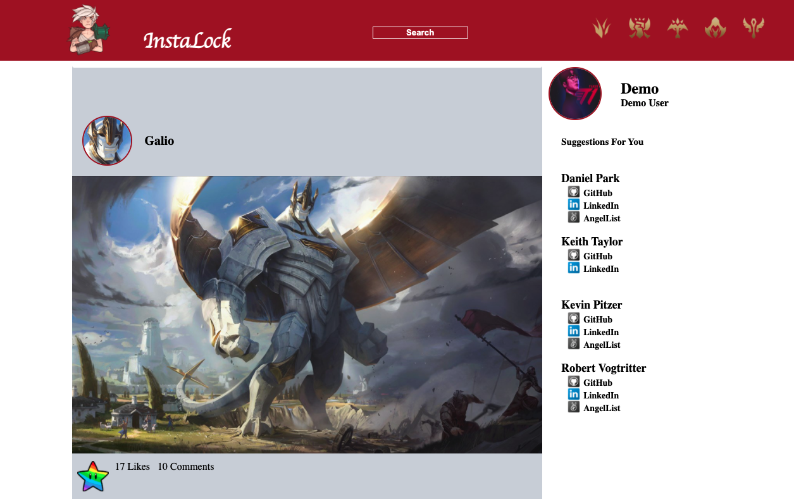

<h1 align="center">InstaLock</h1>

<p align="center">See our site hosted on heroku
<br><a href="https://instalock.herokuapp.com/">InstaLock</a></br></p>
&nbsp

## About
---

Instalock is a spin-off to Instagram. By signing up, it allows users to view other users' profiles and see what posts have been uploaded to our database.

<p align="center">
  
</p>

## Technologies Used
---

-   JavaScript
-   Flask
-   Flask-Migrate
-   Flask-SQLAlchemy
-   Npm
-   Reactjs
-   Redux
-   All styling was done with raw CSS, no frameworks were used.


## How To Use
---
```
# Clone this repository
$ git clone https://github.com/KevKodes/InstaLock.git

# Install flask dependencies in root directory
$ pipenv install --dev -r dev-requirements.txt && pipenv install -r requirements.txt

# Install dependencies in react-app directory
$ cd react-app
$ npm install

# Run back end server from pipenv shell
$ pipenv shell
$ flask run

# Run front end server
$ npm start
```


## Development Environment
---

The database should be generated and seeded with the  commands:
-   `flask db init`
-   `flask db migrate`
-   `flask db upgrade`
-   `flask seed all`


## Wiki Documentation
---

-   [User Stories](https://github.com/KevKodes/InstaLock/wiki/User-Stories)
-   [Front End Routes](https://github.com/KevKodes/InstaLock/wiki/Frontend-Routes)
-   [Database Schema](https://github.com/KevKodes/InstaLock/wiki/Database-Schema)
-   [Feature List](https://github.com/KevKodes/open-eats/wiki/Features)

## Key Technical Features
---
Setting up a route for users to explore for new friends required querying our database in two steps. We first had to query for users not followed by the session user and create a set of those ids. We then returned all the posts for the new set of unfollowed users. In the future, there is the option to only return a specific number of posts at a time. As users scroll through their feed, an unlimited scroll feature would update the page when the user gets to the bottom. This would limit the size of queries and maintain a responsive site for a larger user base.

```python
@post_routes.route('/discovery/<int:id>')
def posts(id):
    all_user_ids = set([x for (x,) in db.session.query(User.id).all()])
    following = db.session.query(follows).filter_by(follower_id=id).all()
    following_ids = [y for x,y in following]

    following_ids.append(id)
    following_set = set(following_ids)
    not_following_set = all_user_ids - following_set

    posts = Post.query.filter(Post.userId.in_(not_following_set),
    Post.vaulted=='false').order_by(Post.createdAt.desc()).all()

    return {"posts": [post.to_dict() for post in posts]}
```


## Future Improvements
---
Future development possibilities for InstaLock include:
- hashtags - allow users to tag their posts with topics to create a stronger social aspect.
- direct messaging - currently users can only communicate through comments on posts. We aim to include direct messaging between users.
